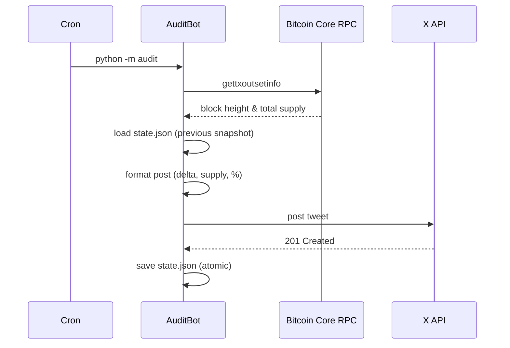
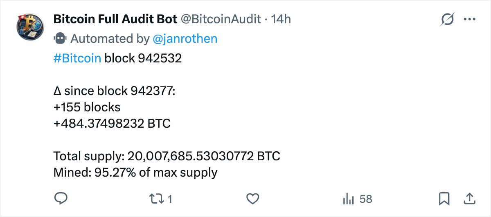

# Bitcoin Audit


A bot that posts the current Bitcoin block height and circulating supply once a day at midnight to X ([@BitcoinAudit](https://x.com/BitcoinAudit)). It connects to a local Bitcoin Core node via RPC, reads the UTXO set, calculates the delta since the previous run, and posts a formatted update. Runs as a cron job on a Raspberry Pi.

## Requirements

- Raspberry Pi 4 (8 GB RAM recommended)
- Bitcoin Core node with RPC enabled and fully synced
- X developer account with read/write app credentials
- Python 3.13+
- Dependencies: `python-bitcoinrpc`, `python-dotenv`, `tweepy`

### Bitcoin Core RPC setup

The bot connects to your node over RPC. Your `bitcoin.conf` must allow connections from the Pi's IP:

```ini
rpcuser=your_rpc_username
rpcpassword=your_rpc_password
rpcbind=0.0.0.0          # or the specific interface IP
rpcallowip=192.168.x.x   # IP of the Pi running this bot
```

Restart Bitcoin Core after editing `bitcoin.conf`.

## Architecture





## Configuration

Configuration is split across two files intentionally:

- **`.env`** — secrets (credentials). Never commit this file.
- **`config.toml`** — non-secret settings (IP, port, timeouts, file paths).

### Credentials (`.env`)

Copy `.env.example` to `.env` and fill in your credentials:

```bash
cp .env.example .env
```

```dotenv
BITCOIN_RPC_USER=your_rpc_username
BITCOIN_RPC_PASSWORD=your_rpc_password

X_CONSUMER_KEY=...
X_CONSUMER_SECRET=...
X_ACCESS_TOKEN=...
X_ACCESS_TOKEN_SECRET=...
```

X credentials are obtained from the [X Developer Portal](https://console.x.com/). Create a project and app there, then generate the consumer keys and access tokens with read/write permissions.

### Settings (`config.toml`)

Edit `config.toml` to customise the behaviour (the `state` section controls where the state file is stored — see [State file](#state-file) below):

```toml
[bitcoin.rpc]
ip      = "192.168.x.x"   # IP of your Bitcoin Core node
port    = 8332
timeout = 900

[state]
file = "state.json"
```

## Install & run

```bash
python3 -m venv .venv
source .venv/bin/activate
pip install -e .
python -m audit
```

> **Note:** The first run saves state only — no post is made. The first post happens on the second run. See [State file](#state-file) for details.

## Development

```bash
pip install -e ".[dev]"
pytest
```

Tests use mock implementations of `BitcoinClientProtocol` and `XClientProtocol` (see `tests/conftest.py`), so no live node or X account is needed to run the test suite.

## Deployment

See [etc/cron.d/README.md](etc/cron.d/README.md) for installation steps.

## Troubleshooting

| Symptom | Likely cause |
|---|---|
| `ConnectionRefusedError` on RPC call | Bitcoin Core is not running, or `rpcbind`/`rpcallowip` not set correctly in `bitcoin.conf` |
| `401 Unauthorized` from RPC | `BITCOIN_RPC_USER` or `BITCOIN_RPC_PASSWORD` in `.env` does not match `bitcoin.conf` |
| `403 Forbidden` from X API | App does not have write permissions — regenerate tokens after enabling read/write in the Developer Portal |
| No post on first run | Expected — the bot bootstraps `state.json` on the first run and posts from the second run onwards |
| Bot not running at midnight | Check `sudo systemctl status cron` and confirm the log file is writable by `pi` |
| `gettxoutsetinfo` times out | The RPC call scans the UTXO set and is slow; increase `timeout` in `config.toml` |

## State file

`state.json` persists the block height and circulating supply from the previous run. It is used to calculate the delta shown in each post.

The file is created automatically on first run — no post is made that time, since there is no previous state to compare against. The second run proceeds normally.

If the file is deleted, the bot bootstraps itself again on the next run.

## Security

- Never commit `.env` — it is listed in `.gitignore`.
- Never commit `state.json` — it is local runtime state.
- RPC credentials in `bitcoin.conf` should match `.env` exactly; restrict `rpcallowip` to the Pi's IP only.
- X access tokens grant write access to the account — treat them as passwords.

## Contributing

Found a bug or have an idea? Open an issue or send a PR.
Run `pytest` before submitting and keep changes focused.

## License

MIT © Jan Rothen — see [LICENSE](LICENSE) for details.
